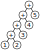

# Math

Build status: 

## TODO

- [ ] Animate equations as rules are applied (or when selecting something in the past)
    - [ ] Add animation bubble when hovering over applicable rules
- [ ] Work on creating tutorials/lessons
- [ ] Expand topics covered

- [ ] Should we make this mobile-friendly?
- [ ] Maybe alter the size of boxes / text depending on what is selected? (helps with focus)

- [ ] Add constraints in rule application?
    - [ ] inequality multiplication to only multiply by positive real number, so the inequality sign flip doesn't happen
    - [ ] applying pythagorus's theorem only when the question contains right-angle triangles

## Context

After tutoring for a year, I've identified some common mistakes that were seen among the students.
These mistakes were mainly part of rearranging equations to solve for some variable in the question.
They don't necessarily affect the understanding of 'high-level' concepts, but mistakes in these
steps can cause high mark questions to be lost, as the number crunching fails.

Some example of these are:
- $3-2x$ written to $1x$
- $4(2+x)$ written to $8+x$
- $\frac{2}{3}*5$ written to $\frac{10}{15}$
- $5-(x+4)$ written to $5-x+4$

Ideally, these mistakes won't appear. But that's highly unlikely to happen.
Making these mistakes once in a while is fine, but it would be great for them to catch these mistakes
during a second-pass of their work.

Additionally, the feeling from the students is "maths is hard". It is true to some extent, especially when
maths becomes more abstract. But when students have that in mind, they tend to over complicate their steps or
to freeze, unable to proceed solving the equation.

### Aim

We have not come up with any measurable criteria, but this is the general direction we wish to
go towards.

- Make students more familiar with mathematical rules
    - Help students observe what is/isn't possible
- Make maths feel simpler / robotic?
    - Create a place that allows students to explore

## Design

The design was approached from 2 perspectives.
1. The students' perspective,
    where the goal is to simplify the user interaction while letting them exercise their mathematical thinking.

2. The teacher/tutor/mentor/supervisor's perspective,
    where the goal is the ability to customize for whichever topic or specific step they want to go through.

### UI

The UI component is mainly designed for the students. This is a main focus of the design as we want this to
be an easy experience for students.

#### Tree

Coming from a computing adjacent background, the most 'raw-bones' representation of math equations is
in the form of an [Abstract Syntax Tree](https://en.wikipedia.org/wiki/Abstract_syntax_tree).
It's useful for students to view equations this way too, as modifying/resolving a small chunk of the tree (i.e.
$2+(3+4)$) will be the same regardless of where it is placed in the equation. To modify the tree representing the
equation, all that's required is to apply rules to it.

This is the [data type](src/Algo/Math.elm) we use internally in the webpage.
Each leaf-node can be thought of as a variable or a number,
while all intermediate nodes are functions with well-defined number of children (with a special case of unknown
functions where we only check that they are consistent within an equation).

An example of this would be: $1+2+3+4+5$, where the corresponding tree will look like:

#### Associative and Commutative Properties

The most common operations that students will use are addition and multiplication (and their corresponding
negations: subtraction and division). There are 2 properties of addition and multiplication that introduces
a lot of steps when applied individually, but actually describe something quite natural. These are the associative
and commutative properties, where one describes the ordering changing ($(a+b)+c=a+(b+c)$), and the other describes
the numbers swapping positions ($a+b=b+a$). These two properties combined means that we can operate on all
these 'chains' in any permutation of the elements.

For these functions (addition and multiplication), instead of displaying them as different possible permutations
of a tree, we can redefine them to take 2+ children, treating them like $\Sigma$ (sum) or like $\Pi$ (product),
taking in a sequence of numbers to add together.

#### Inverses

Subtraction and Division do not share those properties, but can be thought of introducing the inverse of the
groups. Substraction is the combination of Addition with the second number negated, while Division is the combination
of Multiplication with the second number reciprocated. Once we're able to expand subtraction and division into
those combinations, we can leverage the associative and commutative properties of addition and multiplication, to
allow 'minus' and 'divide' to also be able to move freely (i.e. $2+3-4$ is equal to $2-4+3$). Treating them as
separate binary operations will reduce the flexibility, and may hinder opportunities to cancel things out.

Therefore, for both Subtraction and Division, we've opted to translate them into addition/multiplication with
their unary inverse operation.

#### Block

People who have studied language parsing would be familiar with tree structures. However, this is not true
for students who are learning maths. To learn about trees, would increase the complexity for them.
To make this simpler, we thought of displaying this tree as blocks that build on top of each other, like
Legos.

#### Interaction

The main experience is with selecting blocks, and checking in the action-bar to see which action can be applied
to the equation within the selected blocks. It aims to show people which actions are applicable to the nodes,
allowing them to experiemnt without introducing mistakes.

#### History

There is also a history bar, which tracks what states your equations were in. This is useful for jumping back
when wanting to undo (using ctrl+Z also works). But also, it's where equations branching will show up. (i.e.
when an equation with multuiple roots is split into its sub-cases).

### Customisations

Customisations are designed to help individualise the learning / teaching experience and also to share
these experiences with others easily.

#### Rules

These are grouped into topics. There is [an example arithmetic topic here](www/topics/arithmetic.json).

Rules are split into 2 parts. One is pattern to match, and the other is the resulting form by applying
the rule. These rules are considered to be \*universal and can be applied to the equations as a step.
All unknown functions and variables must either be provided by the student when applying the step,
or found within the pattern and extracted from the existing equation. Rules are not allowed to
introduce undefined variables.

\* - We may need to add 'conditions' for when they apply, i.e. pythagorus's theorem only applies when
there are right-angle triangles / the basis are orthogonal. But how can we tell just from equations?

To define a universally recognised variable (also known as a 'global variable'), the constant will need
to be defined in the topic. There are also universally recognised functions (also known as a 'global function'),
these will also need to be defined in the topic, and are able to be used in rules without them appearing
in the initial equation.

These topics are expected to be prepared by some experts (i.e. teachers),
and downloadable for others to use as rules to apply to their equations as they work through problems.

##### Core

There is a core topic included in the webpage. This defines the functions that are included in the notation:
- $+$ - Addition
- $-$ - Negation (this is a unary operation that turns values into negative numbers)
- $*$ - Multiplication
- $/$ - Reciprocal (this is a unary operation that turns values into their multiplicative inverse)
- $=$ - Equation

In addition to those, there are a few actions that are included, as they require special logic to handle:
- $Evaluate$ - Reduces a tree or subtree into a single value, replies on executing javascript (restrictions applied)
- $Number Substitution$ - Expands a number into a user-given expression. Value is checked beforehand.
- $Substitution$ - Replace a variable into its definition, given by another equation, or vice versa.
- $Group$ - Pull child elements of an associative function into a separate block (applying brackets)
- $Ungroup$ - Merge the elements of an associative function with its parent, if it's the same function (removing brackets)

#### Source

Keeping in mind of having things modular, you may want to reuse other people's existing topics as your own.
So we've introduced 'source', where you can specify where you want files to be downloaded from for any topic or
tutorials

#### Tutorials

One issue with the UI so far is that it's not immediately clear how to use this tool. To solve that, there will
be a tutorial for it. But it doesn't stop here. Given that students will also be unsure about how to approach
new topics, a tutorial as an introduction for these will also benefit them. Guiding them to undestand what they
are trying to achieve, and how they go about solving it.

To help guide them, there will be 2 parts. One is a detailed overview, where students can read at their own pace, and
the other is a step-by-step guide, with help pointing at where they need to click next. The first mainly helps with
their understanding, and the other helps with navigating the UI / help identify the patterns.

- [ ] Still under design

#### Guide / Homework

Expanding on tutorials, where there is an ability to set an equation, and know exactly the state of the screen,
we can also introduce homeworks, where multiple equations are listed for students to solve. To submit a homework,
the student can save the file / upload the state, where the teacher will be able to see all the information, including
the history of each step as the student progresses.

- [ ] How important is timing in knowing when the actions were made?

Expanding on this, there can also be automated homework generator, increasing the problem bank, as well as reducing
chances of 'copying homework'.

Expanding on that, there can also be an automated homework marker. Taking the stored file, and having remarks on
what students have tried that deviated from an expected route, and how significant/frequent that deviation is.
This data might allow us to correlate between equations/topics to discover what the student struggles with.

Another idea would be to gamify this, where a class will have some reward system for students that solve a specific
equation with the minimum amount of steps.